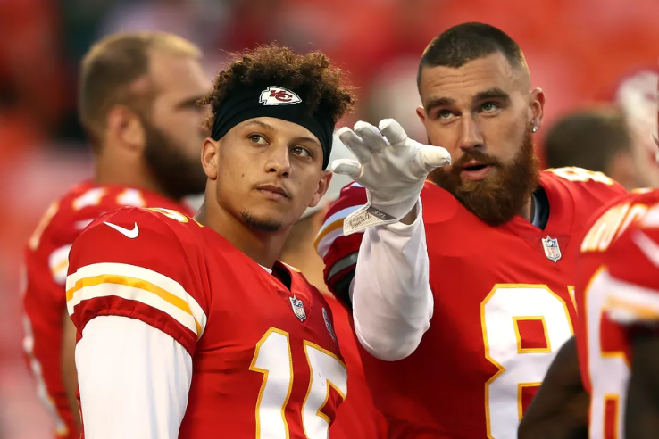
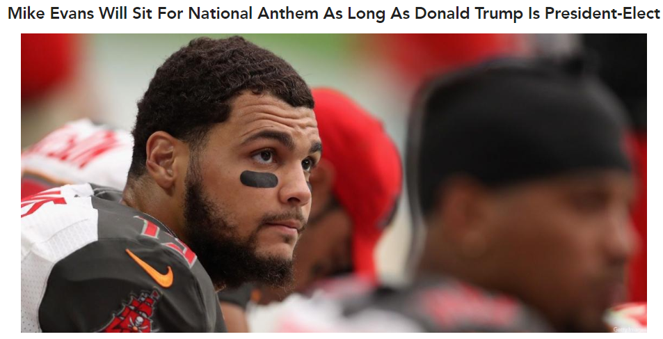

```{r setup, include=FALSE}
options(htmltools.dir.version = FALSE)
knitr::opts_chunk$set(echo = FALSE, message = FALSE, warning = FALSE)
library(tidyverse)
```

## Intro

<iframe width="560" height="315" src="https://www.youtube.com/embed/uLS-WE4K8q0?start=1&end=40" frameborder="0" allow="accelerometer; encrypted-media; gyroscope; picture-in-picture" allowfullscreen></iframe>

---

## Prosperity and Adversity


???

(The intro might make you think that I'm really feeling myself. That the last year has brought me more confidence. It is actually the opposite. At least a small increase of humility, some freedom from ego, gives me the conviction to be the same person I would be in private here before you. And when I hear Andy Mineo say "I don't do the most but I do alot" at home, I too have to Come in Hot. And so I come in hot here.

The last year has been a humbling one. I'd like to say that I, like the Apostle Paul, "have learned to be content whatever the circumstances." I learned that I'm not, and I wasn't. That was a bullet to my self-righteousness. I won't say I'm a model in humility, but I have seen the death of some false humility.

I read, on April 24th in Charles Spurgeon's morning devotional, this quote: "If we would learn to profit by our prosperity, we should not need so much adversity." I have been a poor student. I hadn't learned from some things that were really good in my life, and I was grumbling about the relatively small negatives. Since I ignored the lessons of prosperity God has taught me in the school of adversity. 

Now, what does that have to do with fantasy football? You all were very little help on this journey of adversity, offering little resistance as I steamrolled to a championship; after week 4, I won 12 consecutive games by an average score of 115 - 92. But perhaps it was love that motivated this generosity. so this will not be a time to gloat. not today. this wasn't my championship. this was our championship. each one of you allowed me to defeat you at least once in 2018; Billy, one of my oldest friends, gave me the pleasure of defeating him twice by a total of 53 points; Aaron and VZ even allowed me to beat them thrice, by 67 and 79 points respectively (but who's counting). You truly do embody the apostle Paul's exhortation to "outdo one another in showing honor".

just as this year of prosperity and adversity is working together for my good and greatest joy, i hope that each of you will see that your greatest joy is not in individual triumph, but in working together towards one goal: to see Jerry's Belt Buckle repeat as champion in 2019
---

## Celebrating our victory

--

``` {r celebrate_jeff}
knitr::include_graphics("https://media.giphy.com/media/35HTaxVJWzp2QOShct/giphy.gif")
```

???
And so I want to celebrate OUR victory together. Who's ready to celebrate with me? 
I was skeptical you would go along with this. I've actually predicted your responses with gif's.
advance
About right. C'mon, I mean it-- celebrate with me!
---

## Celebrating our victory

``` {r celebrate_rando}
knitr::include_graphics("https://media.giphy.com/media/vvz5AVSb96m0FY9XFb/giphy.gif")
```

???
I think there's only one thing that will get you off your feet. Even Jimmy Wilson is going to be celebrating with us.

---
## Celebrating our victory

<iframe src="https://open.spotify.com/embed/track/3HkYYew6j5qPe6pl4mkJV3#0:10" width="100" height="50" frameborder="0" allowtransparency="true" allow="encrypted-media"></iframe>

``` {r celebrate_roy}
knitr::include_graphics("https://media.giphy.com/media/3o7abIileRivlGr8Nq/giphy.gif")
```

---
## Celebrating our players

???
next, let's celebrate our players. Because they are our players. This was our championship, and you all have had many of these guys on your teams in the past. You've rooted for them! Remember those good times, and be happy for them now. 

When you see a guy, i think it will be interesting, by a show of hands, to see how much we have a shared history with these guys (and how ridiculous this all really is). We're also going to play a game of "Caption this" for each image.

---

### Zach Zenner

.pull-left[
``` {r ZZ, out.height=400, out.width = 270, eval = TRUE, echo = FALSE}
knitr::include_graphics("https://bloximages.chicago2.vip.townnews.com/mtstandard.com/content/tncms/assets/v3/editorial/6/4c/64c6a5ca-84a4-5421-b10b-a8cd600f941e/5476660842584.image.jpg")
```
]

--

.pull-right[
``` {r BC, out.height=400, out.width = 270, eval = TRUE, echo = FALSE}

```
]

*2019 is not actually Brent Cozart's first year in the league, just his first year as a manager.*

---

### James Conner

.pull-left[
``` {r JC, out.height=450, out.width = 300, eval = TRUE, echo = FALSE}
knitr::include_graphics("https://pbs.twimg.com/media/DxmtrnrX0AI4QNK?format=jpg&name=large")
```
] 
--
.pull-right[
*Maybe Kris would've traded for James Conner if he knew about this haircut.*
]
---

### Saquon Barkley
.pull-left[
``` {r SB, out.height=450, out.width = 400, eval = TRUE, echo = FALSE}
knitr::include_graphics("https://www.centredaily.com/latest-news/5vdy02/picture230568409/alternates/FREE_1140/________saquonWALK.jpg")
```
]

--
.pull-right[
*Can you believe Jerry's Belt Buckle drafted me 4th and he didn't even know what I looked like?* 
]
---

### Travis Kelce

``` {r TK, out.height=400, out.width = 500, eval = TRUE, echo = FALSE}

```

--

*Wow, you threw for 5 TD's and the Commish is still losing...*

---

### Mike Evans

``` {r ME, out.height=400, out.width = 600, eval = TRUE, echo = FALSE}
knitr::include_graphics("http://images.thepostgame.com/sites/default/files/styles/story_main/public/GettyImages-607568072-mike-evans-compressor.jpg")
```

---

### Mike Evans

``` {r ME2, out.height=400, out.width = 600, eval = TRUE, echo = FALSE}

```

*Oh, wow, this is awkward. I guess I don't have to worry about some of you drafting him before me in the 3rd round this year...*

---

## Team Announcements

--

``` {r foster, out.height=400, out.width = 600, eval = TRUE, echo = FALSE}

```

???

JBB has been discussing internally about whether or not to expand our front office. We have made some decisions about the types of hires we will make, but not the long-term structure of the organization. We may be bringing on a new staff member on a short-term basis.
advance

---

## Outro

<iframe width="560" height="315" src="https://www.youtube.com/embed/uLS-WE4K8q0?start=137&end=273" frameborder="0" allow="accelerometer; encrypted-media; gyroscope; picture-in-picture" allowfullscreen></iframe>